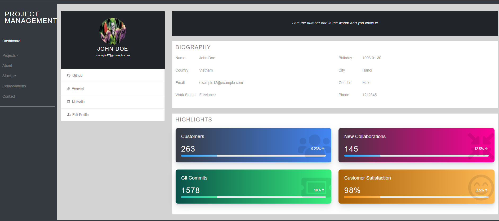

<!--
This README would normally document whatever steps are necessary to get the
application up and running.

Things you may want to c<!--
*** Thanks for checking out this README Template. If you have a suggestion that would
*** make this better, please fork the repo and create a pull request or simply open
*** an issue with the tag "enhancement".
*** Thanks again! Now go create something AMAZING! :D
-->

<!-- PROJECT SHIELDS -->
<!--
*** I'm using markdown "reference style" links for readability.
*** Reference links are enclosed in brackets [ ] instead of parentheses ( ).
*** See the bottom of this document for the declaration of the reference variables
*** for contributors-url, forks-url, etc. This is an optional, concise syntax you may use.
*** https://www.markdownguide.org/basic-syntax/#reference-style-links
-->
[![Contributors][contributors-shield]][contributors-url] 
[![Forks][forks-shield]][forks-url] 
[![Stargazers][stars-shield]][stars-url] 
[![Issues][issues-shield]][issues-url] 
 

# Project-Management-Tool-MERN

>  A MERN project to manage all your personal projects, might be used as portfolio as well. Built with MERN stack and Redux.

Additional description about the project and its features.

Dashboard:

## Built With

- MONGODB
- EXPRESS JS
- REACT
- NODE JS
- REDUX
- REACT-BOOTSTRAP
- EXPRESS-VALIDATOR
- MULTER
- ESLINT
- GITHUB ACTIONS
- VSCODE

